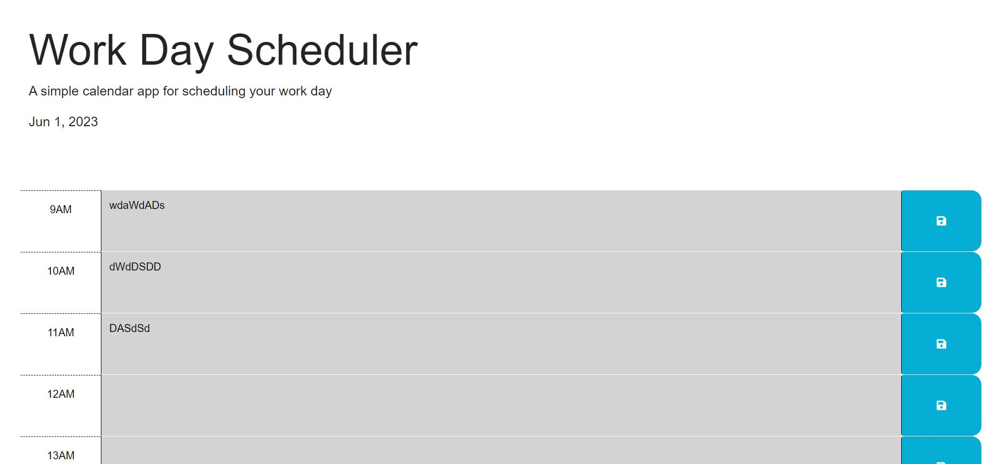

# Module5

## Description

The motivation with this project was to set up a working planner using index, html and css. I believe i set this up properly and fitting as close as i can to the 
needed of the criteria

If your README is long, add a table of contents to make it easy for users to find what they need.

- [Installation](#installation)
- [Usage](#usage)
- [Credits](#credits)
- [License](#license)

## Installation

N/A

## Usage

 

## Credits

N/A

## License
